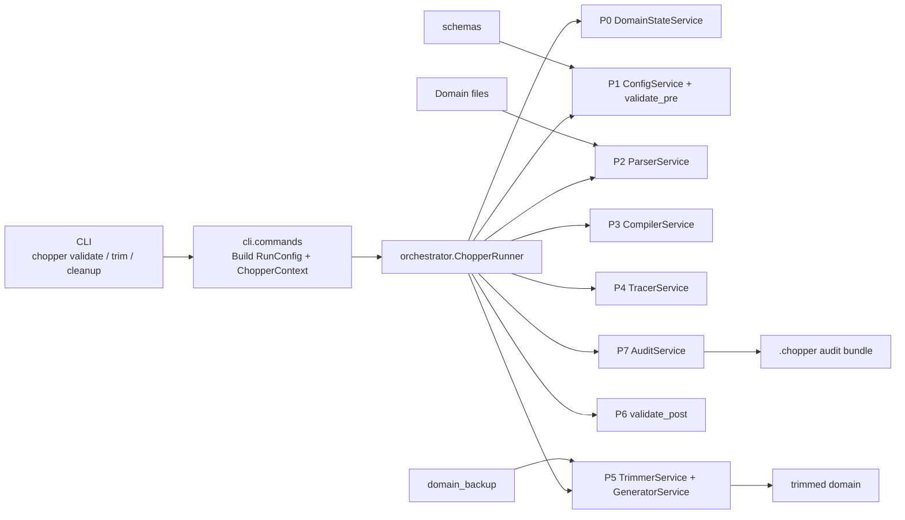
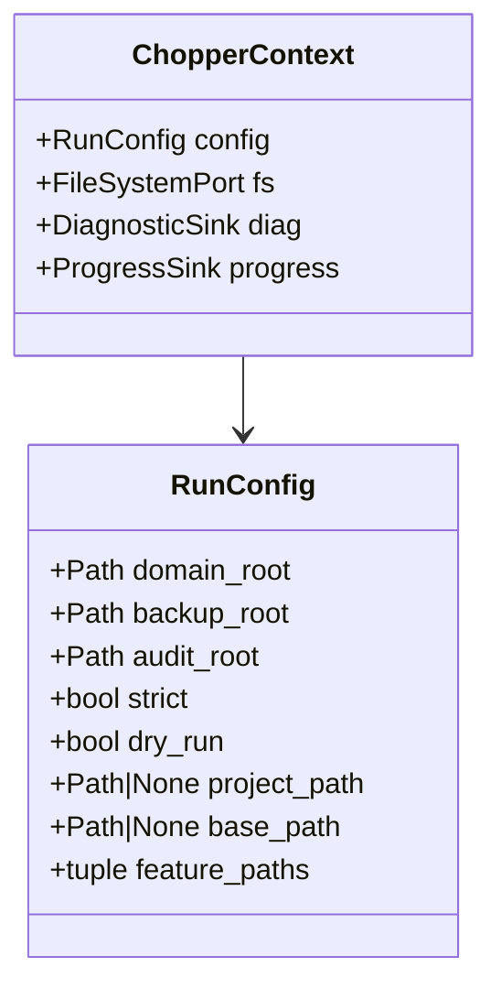
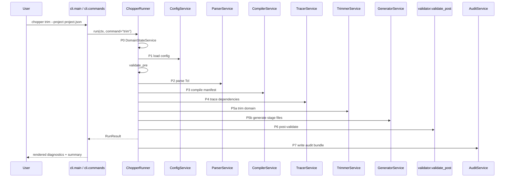
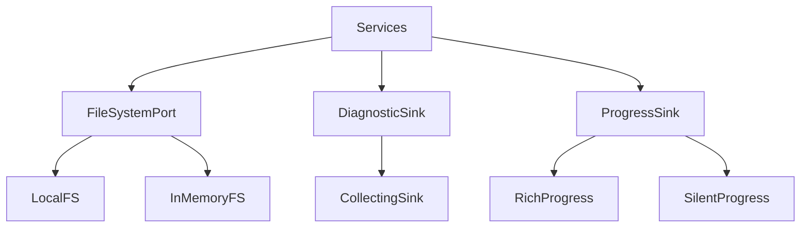
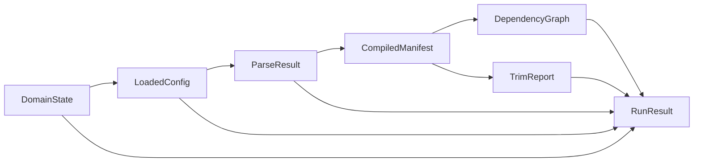
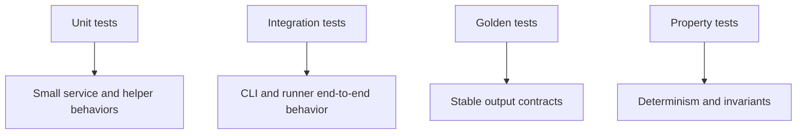

# 🧱 Chopper — Implementation Guide


Code-level guide to how Chopper is actually built. Use it when you want to understand the real implementation, not just user-facing behavior.

> [!NOTE]
> For the short architecture map, see [TECHNICAL_GUIDE.md](TECHNICAL_GUIDE.md). For day-to-day CLI usage, see [USER_MANUAL.md](USER_MANUAL.md). For JSON authoring behavior, see [BEHAVIOR_GUIDE.md](BEHAVIOR_GUIDE.md).

---

## 1. ✂️ What Chopper Is

Chopper is a single-process Python CLI that trims a domain directory into a smaller, project-specific form.

At runtime it does four kinds of work:

1. Load and validate JSON configuration.
2. Parse Tcl files into structured proc records.
3. Compile file and proc decisions, then trace call relationships for reporting.
4. Rebuild the output domain, generate stage files, validate the result, and write an audit bundle.

Its public command surface is intentionally small:

- `chopper validate`
- `chopper trim`
- `chopper cleanup --confirm`

The implementation is organized around an 8-phase pipeline `P0` through `P7`, sequenced by one orchestrator class: `ChopperRunner` in `src/chopper/orchestrator/runner.py`.

---

## 2. 🗺️ Big Picture Architecture



> [!NOTE]
> Chopper is not event-driven and not plugin-based. The CLI builds a `ChopperContext`, hands it to `ChopperRunner`, and the runner executes each phase in order.

---

## 3. 🗂️ Repository Layout

### Runtime code

| Path | What lives there | Why it exists |
| --- | --- | --- |
| `src/chopper/cli/` | `argparse` parser, subcommand handlers, rendering | Turns user input into `RunConfig` and displays `RunResult` |
| `src/chopper/orchestrator/` | Runner, gates, domain-state detection | Owns the phase sequence and gate decisions |
| `src/chopper/core/` | Shared dataclasses, diagnostics, protocols, errors, serialization | Single source of truth for shapes crossing service boundaries |
| `src/chopper/config/` | JSON loading, schema validation, hydration, feature ordering | Implements Phase P1 |
| `src/chopper/parser/` | Tokenizer, namespace tracking, proc extraction, call extraction | Implements Phase P2 |
| `src/chopper/compiler/` | Merge algorithm, trace service, F3 flow resolution | Implements P3 and P4 |
| `src/chopper/trimmer/` | File rewrite and copy logic | Implements P5a |
| `src/chopper/generators/` | Stage file generation | Implements P5b |
| `src/chopper/validator/` | Pre- and post-trim validation functions | Implements P1b and P6 |
| `src/chopper/audit/` | Audit renderers, hashing, bundle writing | Implements P7 |
| `src/chopper/adapters/` | Concrete filesystem, progress, and diagnostic adapters | Connects the service layer to real effects |

### Supporting project areas

| Path | Purpose |
| --- | --- |
| `tests/` | Unit, integration, golden, and property tests |
| `schemas/` | Authoritative JSON schemas (base/feature/project + diagnostic/progress-event/run-result) |
| `examples/` | 11 progressive JSON examples covering every base/feature/project combination |
| `technical_docs/` | Full specification, architecture plan, diagnostics, and implementation rationale |
| `doc/` | User and integrator-facing documentation |

---

## 4. ⚡ The Main Runtime Flow

### 4.1 CLI entry

The CLI starts in `src/chopper/cli/main.py`.

Responsibilities:

- build the top-level argument parser
- enforce `--project` versus `--base` and `--features` exclusivity
- dispatch to one of three handlers in `src/chopper/cli/commands.py`

The three handlers are:

- `cmd_validate(args)`
- `cmd_trim(args)`
- `cmd_cleanup(args)`

Only `validate` and `trim` enter the orchestrator. `cleanup` is a direct filesystem operation that removes `<domain>_backup/` when `--confirm` is present.

`cmd_validate` performs one extra rewrite before context construction: any directory entry in `--features` is expanded in place to the sorted, non-recursive list of its immediate `*.json` children (helper `_expand_feature_dirs`). This is a validate-only authoring convenience per the architecture doc §5.1; `cmd_trim` and `--project` leave `args.features` untouched so the ordered feature sequence recorded in audit artifacts stays unambiguous.

### 4.2 Context construction

`cli.commands` turns CLI arguments into `RunConfig` and then wraps it in `ChopperContext`.

The implementation deliberately separates pure run configuration from effectful adapters.



That split matters because services can stay pure in structure while still doing real work through injected ports.

### 4.3 Orchestrated execution

The core control flow is in `ChopperRunner.run(ctx, command=...)`.



> [!TIP]
> Audit writing happens in the runner’s `finally` block. P7 still runs after earlier failures, as long as writing the audit bundle itself does not crash the process.

---

## 5. 🛣️ Phase-by-Phase Implementation

### P0 — Domain state

Primary code:

- `src/chopper/orchestrator/domain_state.py`
- `src/chopper/core/models.py` (`DomainState`)

Purpose:

- detect whether the domain directory exists
- detect whether `<domain>_backup/` exists
- classify the run into case 1, 2, 3, or 4

Why it matters:

- case 1 means first trim
- case 2 means re-trim from an existing backup
- case 3 means recovery rebuild from backup only
- case 4 is fatal and exits with code `2`

### P1 — Config load and pre-validation

Primary code:

- `src/chopper/config/service.py`
- `src/chopper/config/schema.py`
- `src/chopper/config/loaders.py`
- `src/chopper/validator/functions.py` (`validate_pre`)

What happens:

1. `ConfigService` decides whether the run is in project mode or direct base/features mode.
2. JSON files are read through `ctx.fs`, never directly through `Path.read_text()`.
3. `validate_json()` checks `$schema` and validates against `schemas/`.
4. Raw dictionaries are hydrated into frozen dataclasses such as `BaseJson`, `FeatureJson`, and `LoadedConfig`.
5. Features are topologically sorted through `depends_on` rules.
6. `validate_pre()` performs filesystem and authoring checks such as missing literal files, malformed globs, domain mismatch, duplicate feature references, and empty-base advisories.

Outputs:

- `LoadedConfig`
- pre-validation diagnostics

### P2 — Parse Tcl

Primary code:

- `src/chopper/parser/service.py`
- `src/chopper/parser/tokenizer.py`
- `src/chopper/parser/proc_extractor.py`
- `src/chopper/parser/namespace_tracker.py`
- `src/chopper/parser/call_extractor.py`

What happens:

1. `ParserService` reads each Tcl file through `ctx.fs`.
2. UTF-8 is attempted first; Latin-1 fallback emits `PW-02`.
3. **Phase 2a (surface parse).** Iterate `loaded.surface_files`; `parse_file()` tokenizes content, extracts proc definitions, tracks namespace context, and collects call tokens and `source` references; `PE-*` / `PW-*` / `PI-*` flow through `ctx.diag`.
4. **Phase 2b (full-domain harvest).** Walk every other `.tcl` under `domain_root` (with `.chopper/` excluded), parsing silently through a no-op diagnostic sink — these files were not named by the JSON, so emitting parser diagnostics against them would be misleading. Their `ProcEntry` records still enter the index so P4 trace can resolve calls into non-surfaced files.
5. Results are assembled into `ParsedFile` and then `ParseResult`. The model invariant requires `set(files.procs) ⊆ set(index)` — `files` is the surfaced subset (what the compiler operates on); `index` is the full-domain canonical-name map (what the tracer consults).

Key output model:

- `ProcEntry`
- `ParsedFile`
- `ParseResult`

The parser stage is deliberately split into pure utilities and a service wrapper. That makes low-level parsing easier to unit test without a filesystem or context object.

### P3 — Compile merge decisions

Primary code:

- `src/chopper/compiler/merge_service.py`
- `src/chopper/compiler/flow_resolver.py`

What happens:

1. Each source is converted into per-file facts.
2. Per-source file contributions are classified.
3. Cross-source aggregation computes final file and proc decisions.
4. F3 stage flow resolution computes the generated stage files.

Important implementation rules:

- F1 and F2 merge behavior is order-independent.
- feature order only matters for F3 flow-action sequencing and provenance stamping.
- a whole-file keep wins over trim-style keep sets.

Primary output:

- `CompiledManifest`

### P4 — Trace dependencies

Primary code:

- `src/chopper/compiler/trace_service.py`

What happens:

1. Seeds come from the explicit proc includes present in `manifest.proc_decisions`.
2. The tracer walks call edges breadth-first.
3. The frontier is sorted lexicographically each step to keep output deterministic.
4. Ambiguous, unresolved, dynamic, and cyclic edges emit `TW-*` warnings.

Critical design rule:

- tracing is reporting-only
- it does not modify the compiled manifest
- it does not auto-copy traced callees into the trimmed domain

Primary output:

- `DependencyGraph`

### P5 — Build output

Primary code:

- `src/chopper/trimmer/service.py`
- `src/chopper/trimmer/file_writer.py`
- `src/chopper/trimmer/proc_dropper.py`
- `src/chopper/generators/service.py`
- `src/chopper/generators/stage_emitter.py`

This phase is split into two parts.

#### P5a — TrimmerService

Responsibilities:

- prepare the workspace based on the domain-state case
- rebuild the domain from backup or from the original domain on first trim
- perform `FULL_COPY`, `PROC_TRIM`, and `REMOVE` actions
- produce a `TrimReport`

#### P5b — GeneratorService

Responsibilities:

- emit one `<stage>.tcl` artifact per resolved stage
- write those files in live mode
- return generated artifacts even in dry-run mode so audit can report them

### P6 — Post-validation

Primary code:

- `src/chopper/validator/functions.py` (`validate_post`)

What happens:

- rewritten files are re-checked for brace balance
- surviving proc calls and `source` references are checked for dangling relationships
- generated stage-step references are checked for missing files, procs, and out-of-domain paths

In dry-run mode, manifest-derivable checks still run, but no rewritten files exist to re-read.

### P7 — Audit

Primary code:

- `src/chopper/audit/service.py`
- `src/chopper/audit/writers.py`
- `src/chopper/audit/hashing.py`

What happens:

1. render stable JSON and text artifacts
2. copy input JSONs into the audit bundle when available
3. hash each written artifact
4. return an `AuditManifest`

Important implementation detail:

- audit is best-effort and should not mask the primary pipeline failure

---

## 6. 🔄 Service and Communication Boundaries

Chopper is intentionally built around a narrow set of runtime boundaries.

### 6.1 Ports and adapters

The service layer depends on three protocol surfaces from `src/chopper/core/protocols.py`:

| Port | Used for | Main adapters |
| --- | --- | --- |
| `FileSystemPort` | read, write, list, mkdir, rename, remove | `LocalFS`, `InMemoryFS` |
| `DiagnosticSink` | collect and later finalize diagnostics | `CollectingSink` |
| `ProgressSink` | user-visible phase progress | `RichProgress`, `SilentProgress` |



This design is what makes the test strategy practical: unit tests can inject `InMemoryFS` and a collecting sink, while integration tests can switch to `LocalFS` and exercise the real disk path.

### 6.2 Data passed between phases

The implementation uses frozen dataclasses in `src/chopper/core/models.py` as cross-phase contracts.

The most important records to understand are:

| Model | Produced by | Consumed by |
| --- | --- | --- |
| `DomainState` | P0 | runner, trimmer |
| `LoadedConfig` | P1 | parser, compiler, audit |
| `ParseResult` | P2 | compiler, tracer, trimmer, audit |
| `CompiledManifest` | P3 | tracer, trimmer, generators, validator, audit |
| `DependencyGraph` | P4 | validator, audit |
| `TrimReport` | P5 | audit, final `RunResult` |
| `RunResult` | runner | CLI renderer |



---

## 7. 💻 How to Use Chopper in Practice

The easiest safe operating loop is:

1. `chopper validate ...`
2. `chopper trim --dry-run ...`
3. review `.chopper/trim_report.txt`, `.chopper/compiled_manifest.json`, and `.chopper/dependency_graph.json`
4. `chopper trim ...`
5. `chopper cleanup --confirm` when the backup window is over

### Direct mode

```text
chopper validate --domain path/to/domain --base path/to/base.json --features path/to/f1.json,path/to/f2.json
chopper trim --domain path/to/domain --base path/to/base.json --features path/to/f1.json,path/to/f2.json --dry-run
chopper trim --domain path/to/domain --base path/to/base.json --features path/to/f1.json,path/to/f2.json
```

### Project mode

```text
chopper validate --project configs/project_abc.json
chopper trim --project configs/project_abc.json --dry-run
chopper trim --project configs/project_abc.json
```

Global flags go before the subcommand:

```text
chopper --plain --strict trim --project configs/project_abc.json
```

Operational notes:

- `validate` is read-only analysis
- `trim --dry-run` writes audit output but does not rebuild domain content
- `trim` creates or uses `<domain>_backup/` and rebuilds the domain
- `cleanup` never enters `ChopperRunner`

---

## 8. 🧪 How the Tests Work

The test suite is layered to match the architecture.



### 8.1 Unit tests

Location:

- `tests/unit/`

What they do:

- test one package or one small function at a time
- use `InMemoryFS` heavily
- build `ChopperContext` directly in tests or helpers
- verify diagnostics, returned dataclasses, and edge-case handling

Examples:

- `tests/unit/parser/test_service.py`
- `tests/unit/compiler/test_merge_service.py`
- `tests/unit/orchestrator/test_runner.py`
- `tests/unit/trimmer/test_service.py`

Why they matter:

- fastest feedback
- isolate phase behavior without a real filesystem
- prove invariants on dataclasses and service contracts

### 8.2 Integration tests

Location:

- `tests/integration/`

What they do:

- exercise the real CLI entry or the full runner on real disk
- use `LocalFS` and temporary directories
- seed realistic mini-domains and assert end-to-end outcomes

Examples:

- `tests/integration/test_cli_e2e.py` drives `main(argv)` directly
- `tests/integration/test_runner_localfs_e2e.py` runs `ChopperRunner` with real `LocalFS`

What they validate:

- CLI parsing and subcommand dispatch
- audit bundle creation
- dry-run behavior
- backup/rebuild behavior on real files

### 8.3 Golden tests

Location:

- `tests/golden/`

What they do:

- compare stable JSON output contracts to committed golden files
- make output regressions obvious in `git diff`

The repo standard is JSON-only golden files, documented in `tests/GOLDEN_FILE_GUIDE.md`.

### 8.4 Property tests

Location:

- `tests/property/`

What they do:

- use Hypothesis to explore many input combinations
- focus on invariants that are easy to break accidentally but hard to cover exhaustively with examples

The determinism property tests in `tests/property/test_determinism.py` check:

- serializer idempotence
- insertion-order independence
- BFS traversal determinism

### 8.5 Fixtures and helpers

Supporting inputs live under:

- `tests/fixtures/mini_domain/`
- `tests/fixtures/namespace_domain/`
- `tests/fixtures/tracing_domain/`
- `tests/fixtures/edge_cases/`

These fixtures are not just sample data. They encode the specific parser, compiler, trimmer, and validation edge cases the project cares about.

---

## 9. 🛠️ How to Run the Checks

Primary commands:

```text
make check
make ci
make test
```

Typical narrower commands:

```text
pytest tests/unit/orchestrator/test_runner.py -v
pytest tests/integration/test_cli_e2e.py -v
pytest tests/property/test_determinism.py -v
pytest tests/golden/test_audit_artifacts_golden.py -v
```

What the quality gates cover:

- `ruff` for linting and formatting
- `mypy` for type checking
- `pytest` for tests and coverage
- `import-linter` contracts from `pyproject.toml`
- repo scripts such as `scripts/check_diagnostic_registry.py`

---

## 10. 📚 Reading Order for the Code

> [!TIP]
> Follow the same control flow the program uses. Start at the CLI entry, trace through the runner, then explore each phase service.

If you want to understand the implementation efficiently, read in this order:

1. `src/chopper/cli/main.py`
2. `src/chopper/cli/commands.py`
3. `src/chopper/orchestrator/runner.py`
4. `src/chopper/core/context.py`
5. `src/chopper/core/models.py`
6. `src/chopper/config/service.py`
7. `src/chopper/parser/service.py`
8. `src/chopper/compiler/merge_service.py`
9. `src/chopper/compiler/trace_service.py`
10. `src/chopper/trimmer/service.py`
11. `src/chopper/generators/service.py`
12. `src/chopper/validator/functions.py`
13. `src/chopper/audit/service.py`

That order follows the same control flow the program itself uses.

---

## 11. 💡 Key Design Choices

### Single orchestrator

One class owns phase order. This keeps the runtime easy to reason about and makes failures easy to localize.

### Frozen shared models

The service boundaries use frozen dataclasses from `core/models.py`, so the codebase does not drift into each package inventing its own copies of the same shape.

### Narrow port surface

Only filesystem, diagnostics, and progress are abstracted as ports. That keeps the architecture useful without over-abstracting time, serialization, or audit storage.

### Deterministic output

Sorting rules are built into the implementation rather than treated as a best-effort convention. This is why stable JSON output and reproducible traces are realistic goals rather than documentation claims only.

### Audit always attempted

The runner always attempts P7 in `finally`, which means even partial failures still leave useful investigation artifacts behind.

---

## 12. 🔍 What to Look At When Something Breaks

| Symptom | First places to inspect |
| --- | --- |
| CLI argument failure | `src/chopper/cli/main.py`, `tests/unit/cli/`, `tests/integration/test_cli_e2e.py` |
| JSON load or schema problem | `src/chopper/config/service.py`, `src/chopper/config/schema.py`, `schemas/` |
| Missing or wrong proc extraction | `src/chopper/parser/`, especially `tokenizer.py` and `proc_extractor.py` |
| Wrong keep/drop outcome | `src/chopper/compiler/merge_service.py` |
| Unexpected trace graph | `src/chopper/compiler/trace_service.py` |
| Broken rewrite output | `src/chopper/trimmer/` and `src/chopper/validator/functions.py` |
| Missing audit artifacts | `src/chopper/audit/service.py` and `src/chopper/audit/writers.py` |
| Test-only failure | start with the corresponding package under `tests/unit/`, then move outward to `tests/integration/` or `tests/property/` |

---

## 13. 🎯 Final Mental Model

> [!TIP]
> The most accurate way to think about Chopper:
>
> - a CLI front end
> - feeding one run context
> - into one sequential orchestrator
> - across frozen, typed phase outputs
> - with filesystem, diagnostics, and progress injected as ports
> - and a test suite that mirrors those same boundaries

If you keep that model in mind, the codebase becomes much easier to read. Most modules are small because each one is responsible for exactly one phase or one narrow helper layer inside that phase.
