# Chopper Technical Presentation — Diagrams

> **Companion to:** `docs/TECHNICAL_PRESENTATION_DECK.md`
> **Format:** Mermaid diagrams — render in any Mermaid-compatible tool, or paste into draw.io / PowerPoint SmartArt as reference.
> **Usage:** Each diagram corresponds to a slide visual reference. Copy the Mermaid source into [mermaid.live](https://mermaid.live) to preview, then export as SVG/PNG for PowerPoint.

---

## Diagram 2 — Before/After Domain Reduction

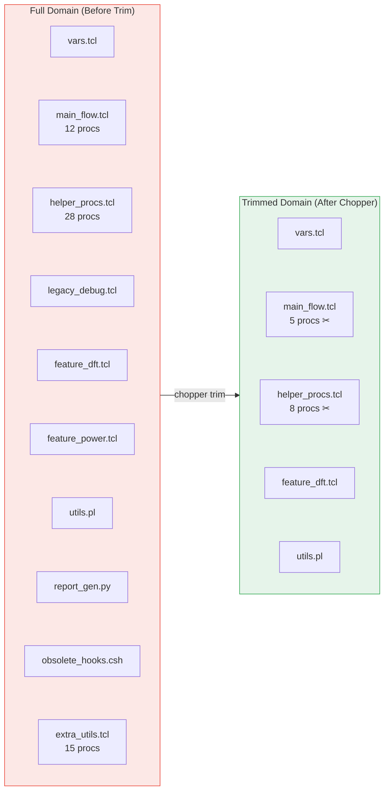

---

## Diagram 3 — Decision Tree: FlowBuilder vs Chopper

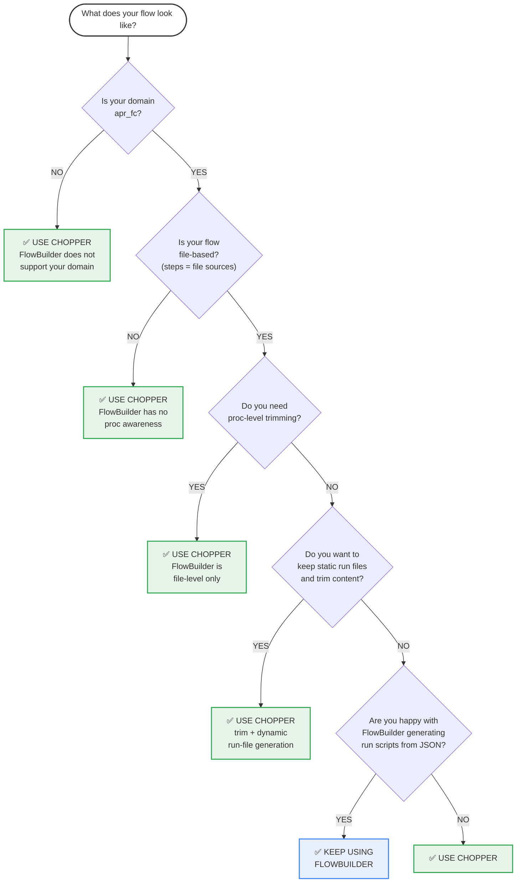

---

## Diagram 4 — FlowBuilder vs Chopper Side-by-Side

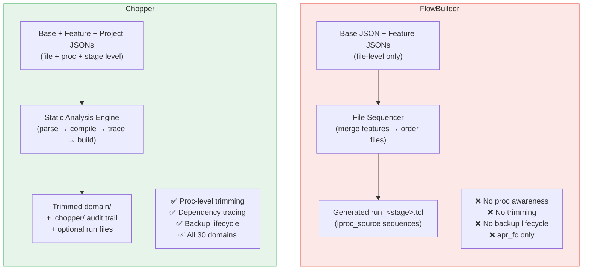

---

## Diagram 5 — JSON Structure Comparison

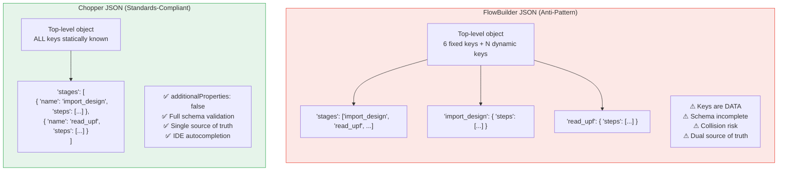

---

## Diagram 7 — Three-Schema Relationship

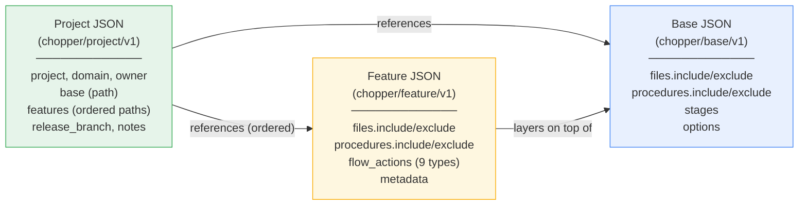

---

## Diagram 8 — Six-Phase Workflow

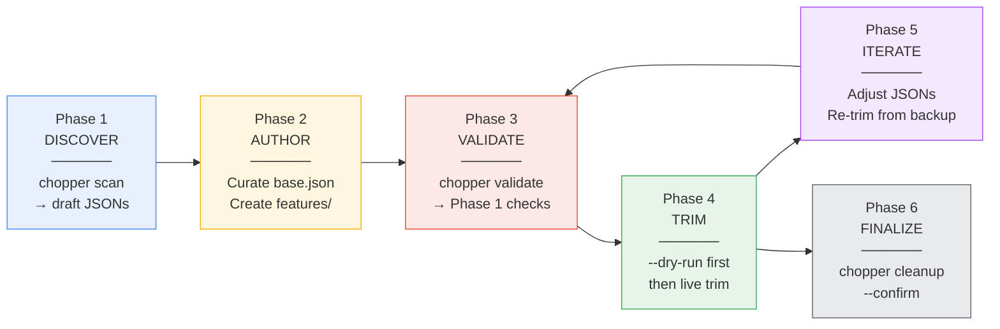

---

## Diagram 9 — Trim Engine Pipeline

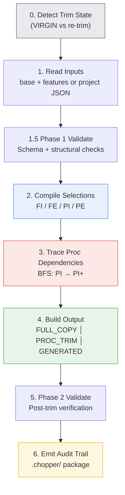

---

## Diagram 11 — Architecture Stack

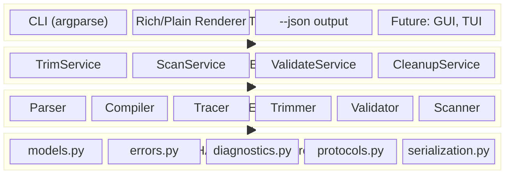

NOTE: If `block-beta` is not supported in your Mermaid version, use this alternative:

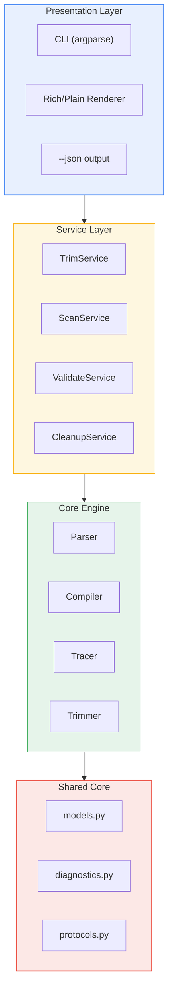

---

## Diagram 12 — Proc Index Structure

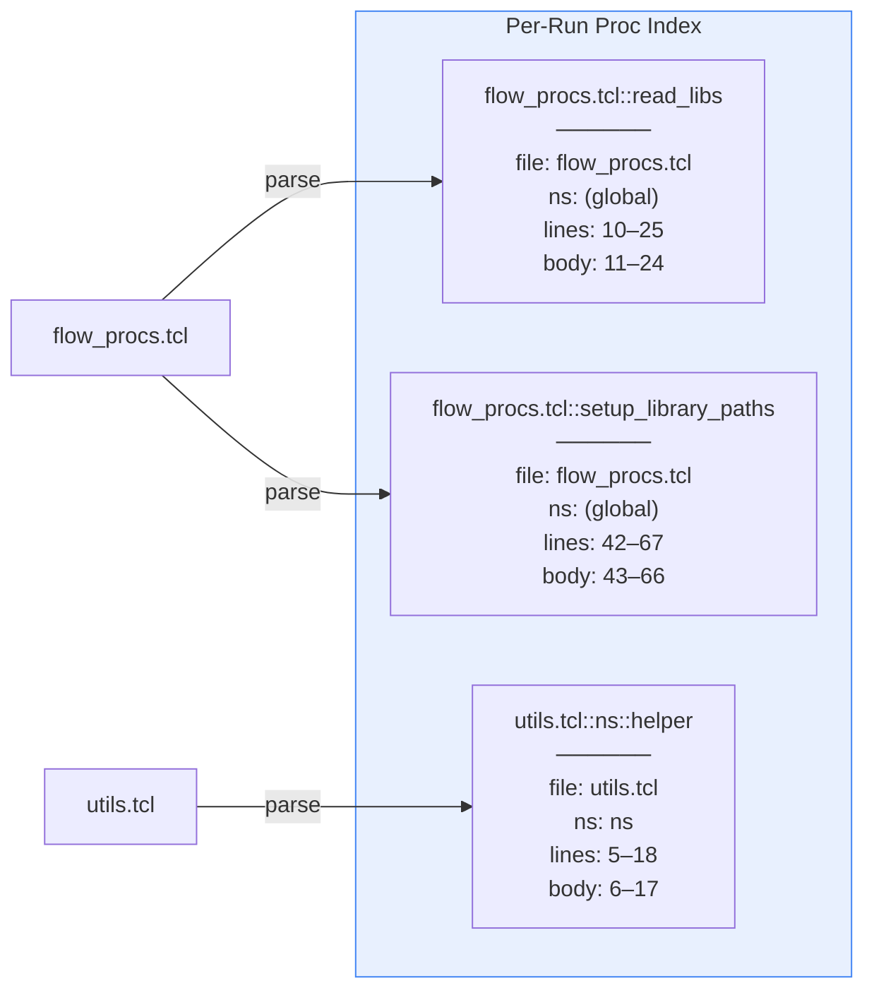

---

## Diagram 13 — Trace Expansion Walk

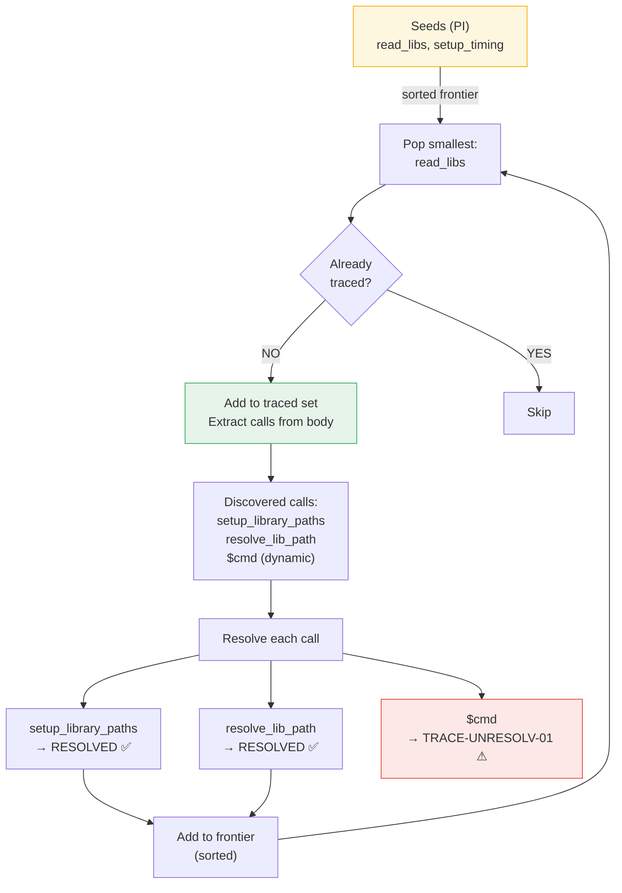

---

## Diagram 14 — Include/Exclude Resolution Flow

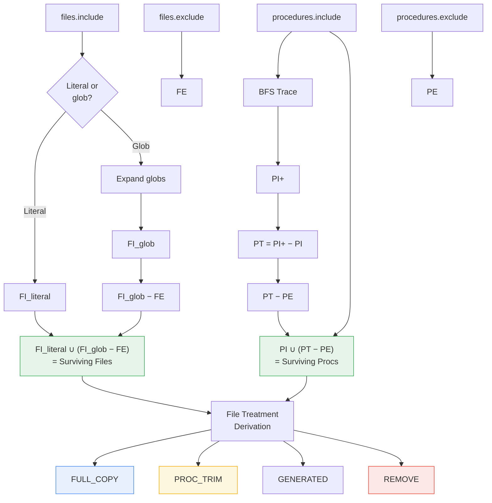

---

## Diagram 15 — Domain Lifecycle State Machine

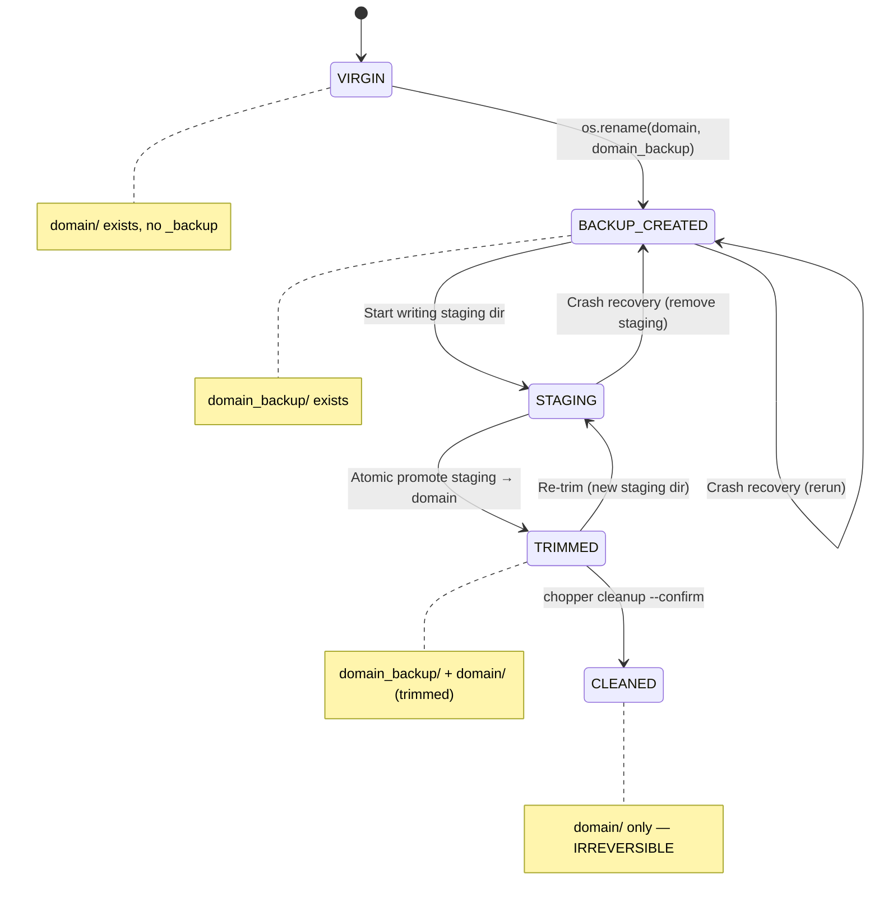

---

## Diagram 16 — Audit Artifact Tree

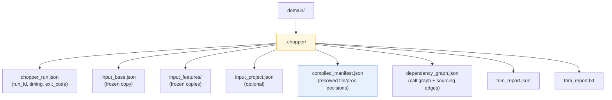

---

## Diagram 17 — Command Matrix

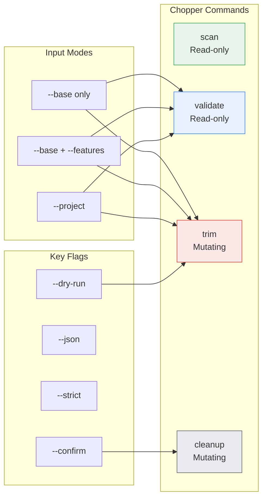

---

## Diagram 18 — Test Pyramid

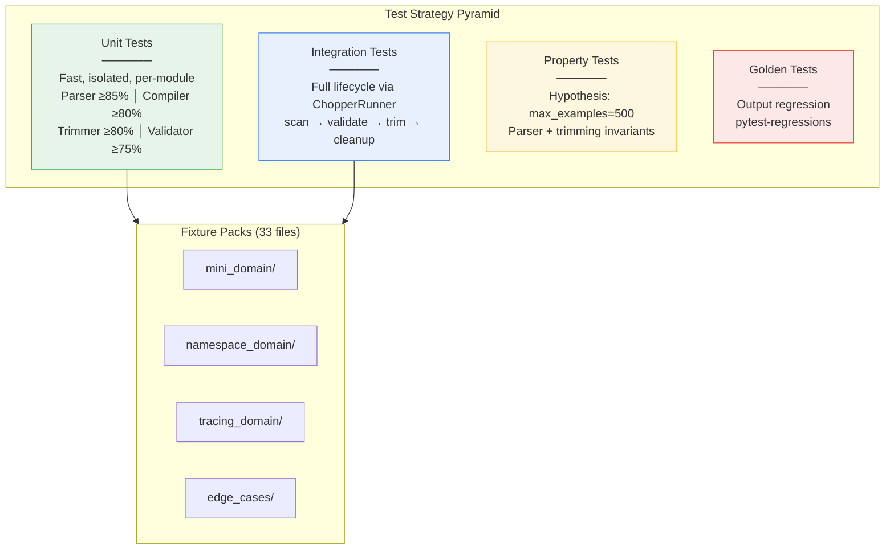

---

## Diagram 19 — Five Pillars of Engineering Credibility

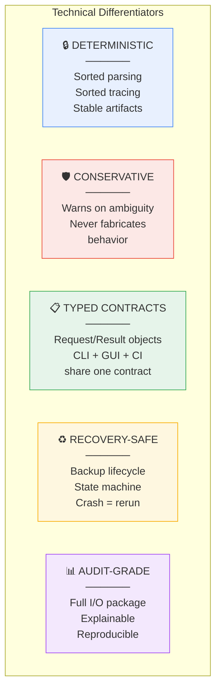

---

## Diagram 20 — Implementation Roadmap

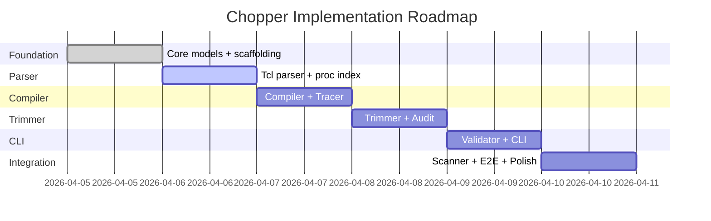

---

## Diagram 6 — Anti-Pattern Anatomy (FlowBuilder JSON)

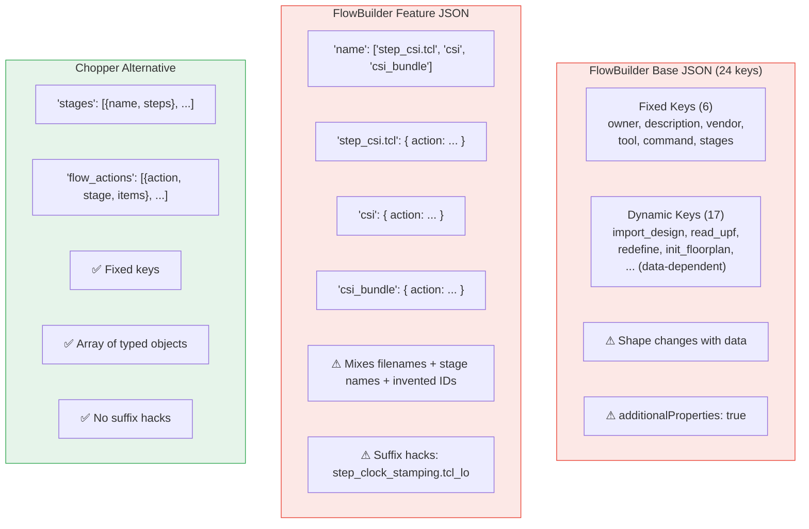

---

## Diagram 10 — Scope Boundary

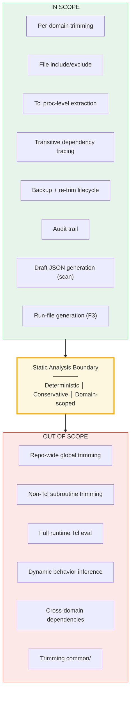

---

## Diagram 21 — Closing Summary

```mermaid
graph LR
    subgraph BUILDS_UP["FlowBuilder: BUILDS UP"]
        FB1["File lists → ordered run scripts<br/>apr_fc only │ No trimming"]
    end

    subgraph TRIMS_DOWN["Chopper: TRIMS DOWN"]
        CH1["Full domain → minimal project subset<br/>All domains │ Proc-level │ Audit-grade"]
    end

    USER{"Domain Owner"} --> DECISION{"Decision Tree<br/>(Slide 3)"}
    DECISION -->|"apr_fc +<br/>file-only +<br/>OK with generated<br/>run files"| BUILDS_UP
    DECISION -->|"Everything<br/>else"| TRIMS_DOWN

    style BUILDS_UP fill:#e8f0fe,stroke:#4285f4
    style TRIMS_DOWN fill:#e6f4ea,stroke:#34a853
    style DECISION fill:#fef7e0,stroke:#f9ab00
```
